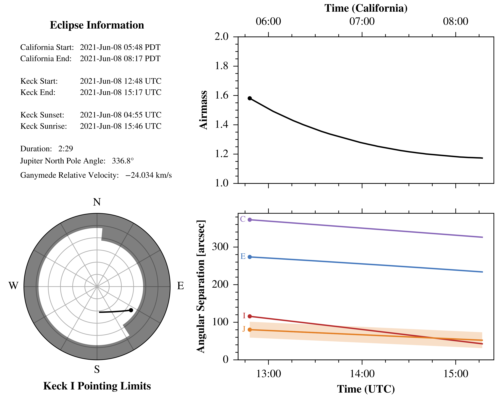

# `khan`: Keck HIRES Aurora pipeliNe

> "You are in a position to demand nothing. I, on the other hand, am in a 
> position to grant nothing."
> 
> —<cite>Khan Noonien Singh, Star Trek II: The Wrath of Khan (1982)</cite>

## Introduction
I'm writing this README text in March 2022. For some reason, despite being one 
of the most productive instruments at the Keck observatory on Mauna Kea, the 
HIRES spectrograph does not have a standard data reduction pipeline. There are 
some exoplanet-specific pipelines which aren't really public, a limited-use 
automatic one that doesn't produce science-quality results (and has failed on 
all of my recent data sets) and some very old IDL-based pipelines that also no 
longer seem to work and are no longer supported anymore by their authors. 
Similarly, the ``PypeIt`` package[^1], intended by its designers to be the 
standard spectroscopic data reduction pipeline for Python, does not yet have 
HIRES support. Like the package's namesake I feel vengeful.

This repository holds my attempt at making an automated pipeline for reducing 
Keck HIRES[^2] echelle spectrograph observations of aurora on the Galilean 
satellites, a project I work on at Caltech with Katherine de Kleer, Mike Brown
and Maria Camarca (also at Caltech) and Carl Schmidt (at Boston University). 
I've cobbled together many ideas and components from a variety of sources 
including the Mauna Kea Echelle Extraction ``MAKEE`` package[^3] and the 
``HIRedux`` IDL reduction pipeline [^4] written by Jason X. Prochaska.

The pipeline will:
1. Detect each order and its bounds, including those crossing between
   detectors,
2. Extract each order from the bias, flat, arc and science frames,
3. Reduce the science frames by subtracting the bias, flat-fielding and
   gain-correcting,
4. Automatically calculate a wavelength solution for each extracted order, and
5. Save the result for easy access and/or archiving (probably as a FITS file 
   since that's the same format as the original data).

I don't really know if this will work without modification for other types of 
HIRES data (I imagine the use of different filters will change how it 
operates). I've made this repository public so anyone can take and modify what 
I've done here.

[^1]: https://pypeit.readthedocs.io/en/release/
[^2]: https://www2.keck.hawaii.edu/inst/hires/
[^3]: https://sites.astro.caltech.edu/~tb/makee/
[^4]: https://www.ucolick.org/~xavier/HIRedux/

## Installation
I've used this code successfully on a Mac running macOS Monterey 
(version 12.2.1) using an Anaconda virtual environment running Python 3.10.0. 
I've also written a few unit tests which Github will automatically run to see 
if the current version runs on their "latest" version of macOS (though this 
probably isn't the latest commercial release). In any case, if I were you, I 
would install this in a virtual environment running Python 3.10 (or newer) so 
you don't mess up any of your other projects.

Here are some installation instructions for the average Anaconda user, if 
you're more advanced I'm sure you can figure it out from here.
1. \[Optional/Recommended\] Create a virtual environment (I've named it
   `myenv` in the example):<br>
   `% conda create --name myenv python=3.10`
2. Activate your virtual environment:<br>
    `% conda activate myenv`
3. Install the `khan` package and its dependencies:<br>
    `% python -m pip install git+https://github.com/zachariahmilby/keck-hires-aurora-pipeline.git`

You're now ready to use the `khan` package! Khaaan!

## Predicting Eclipses
To find when eclipses occur (or to find out information about an eclipse you've 
already observed), import the `EclipsePrediction` class:

```>>> from khan import EclipsePrediction```

To predict eclipses, set a starting and ending date (`'YYYY-MM-DD HH:MM'` 
format, time optional) and a target satellite (`'Io'`, `'Europa'`, `'Ganymede'` 
or `'Callisto'`). You might get an error from Horizons saying your target name
is too ambiguous:
`ValueError: Ambiguous target name; provide unique id`, followed by a list 
of potential alternatives. I found this happened with Io and Europa. For these 
satellites, you can just enter the object ID#: 501 for Io and 502 for Europa. 
Depending on the timespan you've specified, it may take a minute or two to run. 
For example, if you want to predict Ganymede eclipses from June 1 to September 1, 2021:

```
>>> eclipse_prediction = EclipsePrediction(starting_datetime='2021-06-01', ending_datetime='2021-09-01', target='Ganymede')

4 Ganymede eclipse(s) identified between 2021-06-01 and 2021-09-01.

Starting Time (Keck/UTC) Ending Time (Keck/UTC) Starting Time (California) Ending Time (California) Duration Airmass Range  Relative Velocity
2021-Jun-08 12:48        2021-Jun-08 15:17      2021-Jun-08 05:48 PDT      2021-Jun-08 08:17 PDT    2:29     1.173 to 1.581 -24.0 km/s       
2021-Jul-14 09:40        2021-Jul-14 12:06      2021-Jul-14 02:40 PDT      2021-Jul-14 05:06 PDT    2:26     1.222 to 1.994 -16.2 km/s       
2021-Jul-21 12:47        2021-Jul-21 15:29      2021-Jul-21 05:47 PDT      2021-Jul-21 08:29 PDT    2:42     1.181 to 1.670 -12.8 km/s       
2021-Aug-26 11:45        2021-Aug-26 12:15      2021-Aug-26 04:45 PDT      2021-Aug-26 05:15 PDT    0:30     1.359 to 1.481   2.6 km/s       
```

If you choose a time period without any eclipses (like January 1 to February 
1, 2021), you'll get an error message:

```
>>> eclipse_prediction = EclipsePrediction(starting_datetime='2021-01-01', ending_datetime='2021-02-01', target='Ganymede')
Sorry, no eclipses found!
```

`EclipsePrediction` has the method `save_summary_graphics()` which will save a 
small summary graphic to your computer. By default, they save in 
your current working directory. However, you can also specify the 
directory where you want the graphics saved by passing a string of the path or
a `pathlib.Path` object:

```
>>> eclipse_prediction.save_summary_graphics('/path/to/directory')
```

Here's an example of what one of those graphics looks like:



It includes the starting and ending times in local California time (so you know 
how awful of a night you'll have) and UTC, the closest sunrise and sunset times 
to the eclipse, the duration of the eclipse in HH:MM format, the rotation angle 
of Jupiter's north pole and Ganymede's relative velocity. The lower left 
graphic shows the position of the target satellite during the eclipse in 
altitude/azimuth coordinates with an overlay of the Keck I pointing limits. The 
upper right plot shows the target satellite airmass over the course of the 
eclipse. The lower right plot shows the angular separation between the target 
satellite, Jupiter and the other Galilean satellites.

I've also included the ability to automatically generate the list of offsets 
and rates for manual telescope pointing and tracking. For example, if you are 
using Io as the guide satellite:
```
>>> eclipse_prediction.save_pointing_offsets(guide_satellite='Io', save_directory='/path/to/directory')
```
This will save four files: two sets of RA/Dec offsets (from the guide satellite 
to the target and vice-versa) and two equivalent sets of RA/Dec rates, each
formatted with the name of the satellite you are slewing to and the 
properly-formatted terminal command. For example, for June 8, 2021, the first 
three lines of the offset file from Europa (the guide satellite) to Ganymede 
(the eclipse target) `offsets_Europa_to_Ganymede_2021-Jun-08.txt` are
```
Ganymede 12:48   en -257.868 -105.588
Ganymede 12:49   en -257.616 -105.444
Ganymede 12:50   en -257.400 -105.372
```
so simply match the closest UTC time on the telescope status window, then type
the command like `>>> en -257.868 -105.588`.

The rate file which goes with these offsets is 
`rates_Europa_to_Ganymede_2021-Jun-08.txt` and its first three lines look like
```
Ganymede 12:48   modify -s dcs dtrack=1 dra=0.000287388 ddec=0.001614987
Ganymede 12:49   modify -s dcs dtrack=1 dra=0.000287390 ddec=0.001615227
Ganymede 12:50   modify -s dcs dtrack=1 dra=0.000287392 ddec=0.001615467
```
so matching the same time with the offsets, the command would be something like
`>>> modify -s dcs dtrack=1 dra=0.000287388 ddec=0.001614987`.

## Running the Pipeline
There are three steps to running this pipeline.
1. Sort your data files manually so it knows where to find file type. 
   Unfortunately FITS headers are extremely unreliable for recording what the 
   telescope was actually looking at, so you really can't trust them. 
2. Run the data-reduction pipeline.
3. Extract the aurora brightnesses from the reduced data.

See below for details on each of these steps.

### Sorting Your Data
The only particular requirement in place for running the pipeline is to 
pre-sort your data according to the hierarchy structure below. There can be 
multiple sub-directories containing science data, and they don't have to be 
named ``science``, but the others should be named `bias`, `flat`, `arc`, 
`trace` and `flux_calibration`. For instance, you might have taken data from 
two different moons on the same night with the same detector setup (so the 
calibration files work for both), so you put your Ganymede science data in a 
directory called ``ganymede`` and your Callisto science data in a directory 
called ``callisto``. You can then point to these specifically as science data 
directories. The data file names themselves can be in any format (they'll 
probably be in either the non-unique ``hires####.fits``style or the unique 
``HI.YYYYMMDD.#####.fits.gz`` style).

```
data_directory
|
└───bias
│   │   file01.fits.gz
│   │   file02.fits.gz
│   │   ...
│   
└───flat
│   │   file01.fits.gz
│   │   file02.fits.gz
│   │   ...
│   
└───arc
│   │   file01.fits.gz
│   │   file02.fits.gz
│   │   ...
│
└───trace
│   │   file01.fits.gz
│   │   file02.fits.gz
│   │   ...
│
└───flux_calibration
│   │   file01.fits.gz
│   │   file02.fits.gz
│   │   ...
│
└───science
│   │   file01.fits.gz
│   │   file02.fits.gz
│   │   ...
```

### Running the Pipeline
The function `run_pipeline` takes just a few inputs in order to automatically
run. I have tested it on my Ganymede data, and it works for single-detector
pre-mosaic legacy data and mosaic data in both 2x1 and 3x1 binning.

```
>>> from khan import reduce_data
>>> reduce_data(science_target_name='Ganymede', guide_satellite_name='Europa', 
                source_data_path=selected_data_path, save_path=reduced_data_path, 
                quality_assurance=False)
```

The target and guide satellite names are important for properly querying 
JPL's Horizons Ephemeris Service. The `source_data_path` points to the 
directory into which you pre-sorted your data files. The `save_path` points to
where you want the reduced data files (and quality-assurance graphics) saved.

Speaking of quality-assurance graphics, the `quality_assurance` keyword lets
you choose whether or not the pipeline saves graphics along the way so you can
check to see if anything failed or otherwise worked poorly. These graphics 
include:
1. Images of the master bias, master flat, master arc and master trace, 
2. The detected edges of the orders
3. Sets of images showing each of the science observations (Jupiter 
   calibration, guide satellite and target satellite) at each stage of
   instrument correction:
   1. Raw
   2. After cosmic-ray correction
   3. After bias-subtraction
   4. After flat-field correction, and
   5. After gain correction, and
4. The third-degree polynomial wavelength solutions for each order and the
   residuals of the fit.

> **WARNING**<br>
> Saving quality-assurance graphics substantially increases the 
> runtime of the pipeline, and due to a memory leak in Matplotlib, it may put 
> too much memory pressure on your system and cause a SystemExit. I found I 
> could run individual observation nights one at a time, but I could not reduce
> multiple nights using a loop.

Once the pipeline has finished reducing the data, you should have two FITS 
files in the `save_path` directory you specified: `flux_calibration.fits.gz`
and `science_observations.fits.gz`.

#### Flux Calibration Data

The `flux_calibration.fits.gz` file has the following structure:
```
>>> from astropy.io import fits
>>> with fits.open('flux_calibration.fits.gz') as hdul:
>>>     hdul.info()

Filename: flux_calibration.fits.gz
No.    Name      Ver    Type      Cards   Dimensions   Format
  0  PRIMARY       1 PrimaryHDU      28   (4096, 20, 32, 5)   float64   
  1  BIN_CENTER_WAVELENGTHS    1 ImageHDU         9   (4096, 32)   float64   
  2  BIN_EDGE_WAVELENGTHS    1 ImageHDU         9   (4097, 32)   float64   
  3  ECHELLE_ORDERS    1 BinTableHDU     11   32R x 1C   [I]   
  4  OBSERVATION_INFORMATION    1 BinTableHDU     18   5R x 4C   [25A, D, 19A, E]   
```
The `PRIMARY` extension holds the reduced Jupiter flux calibration data.
`BIN_CENTER_WAVELENGTHS` are the wavelength solution values for the center of
each spectral bin. Similarly, `BIN_EDGE_WAVELENGTHS` are the solution values
for the edges of each bin (in case you wanted to use 
`matplotlib.pyplot.pcolormesh` to display an image with a horizontal wavelength
axis). `ECHELLE_ORDERS` holds the actual echelle order number for each of the
orders included in the data and the wavelength solutions. Finally, the 
`OBSERVATION_INFORMATION` extension holds some ancillary information about the 
observations themselves. More on all of this below.

The `PRIMARY` header contains most of the information that isn't 
observation-specific. Here's what the primary header looks like for the 
calibration frames for our June 8, 2021 data. This should tell you everything
you might need to know or access about general observation setup. It also 
includes the units of the primary extension and a list of the reductions that
the pipeline applied to the data.

```
>>> print(repr(hdul['PRIMARY'].header))

SIMPLE  =                    T / conforms to FITS standard                      
BITPIX  =                  -64 / array data type                                
NAXIS   =                    4 / number of array dimensions                     
NAXIS1  =                 4096 / number of spectral bins                        
NAXIS2  =                   20 / number of spatial bins                         
NAXIS3  =                   32 / number of echelle orders                       
NAXIS4  =                    5 / number of observations                         
EXTEND  =                    T                                                  
TARGET  = 'Jupiter '           / name of target body                            
BUNIT   = 'electrons/second'   / physical units of primary extension            
OBSERVER= 'de Kleer, Brown, Camarca, Milby' / last names of observers           
LAYOUT  = 'mosaic  '           / detector layout (legacy or mosaic)             
SLITLEN =                  7.0 / slit length [arcsec]                           
SLITWID =                1.722 / slit width [arcsec]                            
XDNAME  = 'red     '           / name of cross diserpser                        
XDANG   =                1.318 / cross disperser angle [deg]                    
ECHANG  =             -0.71594 / echelle angle [deg]                            
SPABIN  =                    3 / spatial binning [pix/bin]                      
SPEBIN  =                    1 / spectral binning [pix/bin]                     
SPASCALE=                0.358 / spatial bin scale [arcsec/bin]                 
SPESCALE=                0.179 / spectral bin scale [arcsec/bin]                
PIXWIDTH=                 15.0 / pixel width [micron]                           
REDUX00 = 'cosmic_rays_removed' / reduction applied to primary extension        
REDUX01 = 'bias_subtracted'    / reduction applied to primary extension         
REDUX02 = 'flat_field_corrected' / reduction applied to primary extension       
REDUX03 = 'gain_corrected'     / reduction applied to primary extension         
REDUX04 = 'rectified'          / reduction applied to primary extension         
REDUX05 = 'airmass_ext_corrected' / reduction applied to primary extension
```

Similar (but much less) information exists in the headers for the other 
extensions. For instance, the header for `BIN_EDGE_WAVELENGTHS` looks like 
this:

```
XTENSION= 'IMAGE   '           / Image extension                                
BITPIX  =                  -64 / array data type                                
NAXIS   =                    2 / number of array dimensions                     
NAXIS1  =                 4097 / number of spectral bin edges                   
NAXIS2  =                   32 / number of echelle orders                       
PCOUNT  =                    0 / number of parameters                           
GCOUNT  =                    1 / number of groups                               
EXTNAME = 'BIN_EDGE_WAVELENGTHS' / extension name                               
BUNIT   = 'nm      '           / wavelength physical unit
```

You can access observation-specific information from the table stored in the
`OBSERVATION_INFORMATION` extension. It includes the original filenames of each
of the observations, their exposure times, the start time of the observations
in ISOT format `YYYY-MM-DDTHH:MM:SS.sss`, and the airmass at the start of the
exposure.

```
>>> print(hdul['OBSERVATION_INFORMATION'].columns)
    
ColDefs(
    name = 'FILENAME'; format = '25A'
    name = 'EXPTIME'; format = 'D'; unit = 'seconds'
    name = 'OBSDATE'; format = '19A'
    name = 'AIRMASS'; format = 'E'
)
```

#### Science Target Data

The file structure of `science_observations.fits.gz` is similar, but has both
the target satellite data and the guide satellite data.

```
>>> from astropy.io import fits
>>> with fits.open('science_observations.fits.gz') as hdul:
>>>     hdul.info()

Filename: science_observations.fits.gz
No.    Name      Ver    Type      Cards   Dimensions   Format
  0  PRIMARY       1 PrimaryHDU      28   (4096, 20, 32, 17)   float64   
  1  GUIDE_SATELLITE    1 ImageHDU        12   (4096, 20, 32, 17)   float64   
  2  BIN_CENTER_WAVELENGTHS    1 ImageHDU         9   (4096, 32)   float64   
  3  BIN_EDGE_WAVELENGTHS    1 ImageHDU         9   (4097, 32)   float64   
  4  ECHELLE_ORDERS    1 BinTableHDU     11   32R x 1C   [I]   
  5  SCIENCE_OBSERVATION_INFORMATION    1 BinTableHDU     18   17R x 4C   [25A, D, 19A, E]   
  6  GUIDE_SATELLITE_OBSERVATION_INFORMATION    1 BinTableHDU     18   17R x 4C   [25A, D, 19A, E]   
```

For this file, the `PRIMARY` extension holds the target satellite data, and the
`GUIDE_SATELLITE` data holds the...wait for it...guide satellite data! It also
includes the same wavelength and echelle order information as the flux 
calibration data file, and has individual observation-specific information 
tables for the target and guide satellites.

## Retrieving Aurora Brightnesses

The function `get_aurora_brightnesses` takes the reduced data, flux-calibrates
the science images and extracts the surface brightness in rayleigh at the 
following wavelengths (if the detector setup captured them):
1. 557.7339 nm O(¹S) to O(¹D)
2. The "red" doublet (done as separate lines):
   1. 630.0304 nm O(¹D) to O(³P₀)
   2. 636.3776 nm O(¹D) to O(³P₂)
3. 656.2852 nm Balmer-alpha (Hα)
4. The 777.4 nm OI triplet:
   1. 777.1944 nm O(⁵P₃) to O(⁵S₂)
   2. 777.4166 nm O(⁵P₂) to O(⁵S₂)
   3. 777.5388 nm O(⁵P₁) to O(⁵S₂)
5. The 844.6 nm OI triplet:
   1. 844.6247 nm O(³P₀) to O(³S₁)
   2. 844.6359 nm O(³P₂) to O(³S₁)
   3. 844.6758 nm O(³P₁) to O(³S₁)

The brightness retrieval is slightly less automated than the reduction 
pipeline, so you may need to run it a few times and adjust some parameters 
until you achieve a good result. I haven't yet been able to figure out a way to
automate this stage, since it's more of an art than a science.

To run the retrieval:

```
>>> get_aurora_brightnesses(reduced_data_path=reduced_data_path, save_path=analysis_save_path, 
                            top_trim=2, bottom_trim=2, seeing=1.5, background_degree=1)

Retrieving brightnesses at 557.7 nm...
Retrieving brightnesses at 630.0 nm...
Retrieving brightnesses at 636.4 nm...
Retrieving brightnesses at 777.2 nm...
Retrieving brightnesses at 777.4 nm...
Retrieving brightnesses at 777.5 nm...
Retrieving brightnesses at 844.6 nm...
Retrieving brightnesses at 656.3 nm...
```

The first two arguments are simply paths to where you saved your reduced data
from the previous step (`reduced_data_path` is the same as the `save_path` 
used in `run_pipeline`), and the new `save_path` is the location where you want
the retrieval outputs saved. 

The arguments you may need to adjust are the following:
1. `seeing` accounts for the spread of the signal beyond the actual physical 
   size of the target satellite (in this case, the angular size). This argument
   lets you add to the radius of the target satellite to increase the size of 
   the aperture with which you capture the brightness. The aperture has a size
   (𝘙 + seeing)² where 𝘙 is the apparent angular radius of the target
   satellite. I correct the final reported brightness by scaling it by the 
   ratio of the aperture size to the target size ((𝘙 + seeing)/𝘙)².
2. `exclude` lets you exclude selected observations from averaging for a 
   particular wavelength. For instance, if you wanted to exclude the first
   three images from averaging for 777.4 nm and 844.6 nm, you would pass this
   dictionary:

   ```{'777.4 nm': [0, 1, 2], '844.6 nm': [0, 1, 2]}```

   For the pipeline as it currently is, you have to define these exclusions for
   every wavelength if you want to exclude the same frame from all of the 
   averages. Here's a full dictionary template to use:
   
   ```
   {
    '557.7 nm': [],
    '630.0 nm': [],
    '636.4 nm': [],
    '656.3 nm': [],
    '777.4 nm': [],
    '844.6 nm': []
   }
   ```
3. `y_offset` lets you adjust the vertical offset in case the satellite wasn't
   well centered in the slit. Note that this offset takes place after the 
   trimming below, so if you change the trim the position of the offset will 
   also change.
4. `top_trim` is how many rows to eliminate from the top of each order. The 
   rectification process will produce some weird, sawtooth-like effects and 
   they can mess up the fitting of the background and the estimation of the
   noise. A value of `top_trim=2` seems to be typical (and is the default), but 
   is is probably dependent on the binning.
5. `bottom_trim` is the same but for the bottom of each order. If the edge
   detection wasn't quite symmetric around the center of each order, the top
   and bottom trim values might not be the same. The default is `bottom_trim=2` 
   for both trim values. An initial run without any trimming might be useful to 
   get an idea of how many rows you should eliminate.
6. `additional_wavelengths` is technically not supported yet, but I've added
   a few additional aurora wavelengths to consider in the future. These include
   the sodium doublet at 588.9950 and 589.5924 nm, sulfur at 772.5046 nm, 
   potassium at 766.4899 nm, carbon at 872.7126 nm and chlorine at 837.5943 nm.  

You can evaluate the results of a retrieval by looking at several output types.
It produces output with the following directory structure (I've only filled out 
the example for 630.0 nm, but it applies to all the wavelengths):

```
557.7 nm
630.0 nm
|
└───results.txt
│   spectra_1d
│   └───average_fit_params.txt
│   │   average_fit_report.txt
│   │   average.pdf
│   │   average.txt
│   │   ...
│   spectra_2d
│   └───average.pdf
│   │   average.txt
│   │   ...
636.4 nm
656.3 nm
777.4 nm
844.6 nm
```

In the `spectra_2d` directory:
- `average.pdf` is an image which shows the average raw image with the seeing 
   aperture outlined, the fitted background, the background-subtracted image, 
   and the background-subtracted image smoothed with a Gaussian kernel.
- `average.txt` is the background-subtracted image saved to a text file in case
   you want to make a paper graphic or something. You can get the wavelengths 
   for each of the horizontal pixels from either the 
   `science_observations.fits.gz` file or the `average.txt` file from the
   `spectra_1d` directory (see below).

In the `spectra_1d` directory:
- `average_fit_params.txt` gives the initial and best-fit values for the
Gaussian function parameters. This is particularly useful if you want to see if
your wavelength calibration frames were off (ours usually were bu at least a
few spectral pixels.)
- `avereage_fit_report.txt` is a human-readable version of the fit results.
- `average.pdf` is an output of the 2D spectrum summed over the rows containing
   the seeing aperture. It also includes the best-fit Gaussian.
- `average.txt` contains the data in `average.pdf` in case you want to make a
   similar plot for a paper. It includes rest and doppler-shifted wavelengths,
   the observed spectrum, the fitted spectrum and the fitted uncertainty.

Finally, the summary `results.txt` file includes the observed brightnesses, 
estimated uncertainty from the observed background, Gaussian-fitted 
brightnesses and their uncertainties, the background electron flux (for 
background comparison between observations or observing nights), the separation 
between Jupiter's limb and the target in units of Jupiter angular radii, and 
whether a particular image was included in the average (see the `exclude` 
option above). It also reports all of these values for the average image.

Here's an example of one of those files for the 630.0 nm brightnesses from 
June 8, 2021:

```
date measured_brightness_[R] measured_uncertainty_[R] fitted_brightness_[R] fitted_uncertainty_[R] bg_electron_flux_[e/s/arcsec2] limb_separation_[r/R_J] included_in_avg
2021-06-08T12:58:16 114.38788510586365 2.176997831892849 127.12372735841755 3.5396599526937216 33 2.71 True
2021-06-08T13:05:29 105.78947294585127 2.9706009809498926 121.72294174643538 4.128518842098819 33 2.65 True
2021-06-08T13:22:12 133.78681762574294 3.4598181142855333 139.53956749991252 3.9854066943303272 36 2.50 True
2021-06-08T13:29:41 120.6999777862233 3.5702097471184273 134.293459692529 4.259046809243917 36 2.44 True
2021-06-08T13:36:46 132.05449862611027 3.433403582051226 145.08130497149816 4.2756023006184165 35 2.37 True
2021-06-08T13:44:33 151.3158700316101 3.60910064579896 161.55707369355244 4.2107964215348535 36 2.30 True
2021-06-08T13:51:41 160.43660854708202 3.5243080592258216 160.6911693298914 4.059741244945436 35 2.24 True
2021-06-08T13:58:52 128.82637564226744 3.3266112651812136 135.66693947660414 4.187324893494349 35 2.17 True
2021-06-08T14:08:09 150.38561425227755 2.7016045317121518 165.54493860386032 4.067890135796443 36 2.09 True
2021-06-08T14:15:28 127.33538297809552 3.6564938659377533 136.50224934884363 4.338931545519123 39 2.03 True
2021-06-08T14:22:45 148.07538372474164 3.5726334416447716 152.5760630533286 4.403000930974958 41 1.96 True
2021-06-08T14:29:56 164.24310438210827 3.835272429799544 178.06205529698107 4.5388203857731195 43 1.90 True
2021-06-08T14:37:35 171.72785683019103 4.0019301419368505 182.2380841391468 4.686089814108676 45 1.83 True
2021-06-08T14:44:47 152.05050267806627 4.149820680039169 162.07865196020322 4.691616667803005 47 1.77 True
2021-06-08T14:52:33 133.69925706139287 3.8521670891260738 137.33620694811236 4.362427624967849 51 1.70 True
2021-06-08T15:01:18 125.38758111484458 3.9622254243182806 128.5337425718581 4.603832257550263 60 1.62 True
2021-06-08T15:08:29 100.72844026897099 5.540219516129061 116.74119636153164 6.452548709978012 93 1.55 True
average 139.58312536656894 1.0286513503451231 147.5525661782082 1.549113497693975 44.0 --- ---

```

That's pretty much all there is to it. Each time I retrieve brightnesses, I run
it a few times until I've figured out the right trim and seeing values, then 
use the results in the `results.txt` file.

## Example
Here's an example based on a script I wrote to process the June 8, 2021 
Ganymede eclipse data:

```
from pathlib import Path
from khan import reduce_data, RawFiles, SelectedFiles, get_aurora_brightnesses

# set various directories
date = '2021-06-08'
parent_directory = Path(f'/path/to/project/directory')
raw_files_path = Path(parent_directory, 'Data', 'raw', date)
selected_files_path = Path(parent_directory, 'Data', 'selected', date)
reduced_data_path = Path(parent_directory, 'Data', 'reduced', date)
save_path = Path(parent_directory, 'Analysis', date)

# get the raw data files
raw_files = RawFiles(directory=raw_files_path, target='Ganymede')

# make summary spreadsheet and graphics for the raw data files to help me 
# select and sort them
raw_files.process_files()

# get the sorted selected files
selected_files = SelectedFiles(directory=selected_files_path, target='Ganymede')

# make summary spreadsheet graphics for the selected files
selected_files.process_files(make_planning_graphic=True)

# reduce the selected data
reduce_data(science_target_name='Ganymede', guide_satellite_name='Europa',
            source_data_path=selected_files_path, save_path=reduced_data_path,
            quality_assurance=True)

# exclude some of the later observations from the 777.4 and 844.6 nm averages
exclude = {
    '777.4 nm': [14, 15, 16],
    '844.6 nm': [12, 13, 14, 15, 16]
}

# get the aurora brightnesses
get_aurora_brightnesses(reduced_data_path=reduced_data_path,
                        save_path=save_path, seeing=1, y_offset=0,
                        exclude=exclude)
```

## Ancillary Functions
There are a few ancillary functions I've made available, mostly because I 
wanted an easy way to plot some of the data used in the calibrations. The
functions available are:
1. `get_meridian_reflectivity` which returns a dictionary containing 
   wavelengths and Jupiter meridian reflectivity (I/F) values from Woodman et
   al. (1979).[^5]
2. `get_mauna_kea_summit_extinction` which returns a dictionary containing
   wavelengths and airmass- and wavelength-dependent extinction for the summit
   of Mauna Kea from Buton et al. (2003).[^6]
3. `get_solar_spectral_radiance`: which returns a dictionary containing the 
   theoretical solar spectral radiance above Earth's atmosphere at 1 au from 
   the Sun. The original data were actually spectral irradiance (W/m²/nm) which 
   I converted to radiance by dividing by pi, giving units of W/m²/nm/sr. The 
   spectral irradiance data come from the 2000 ASTM Standard Extraterrestrial 
   Spectrum Reference E-490-00.[^7]

[^5]: Woodman, J. H., et al. (1979), Spatially resolved reflectivities of 
      Jupiter during the 1976 opposition, Icarus, 37(1), 73-83, 
      doi:10.1016/0019-1035(79)90116-7
[^6]: Buton, C., et al. (2012), Atmospheric extinction properties above Mauna 
      Kea from the nearby Supernova Factory spectro-photometric data set, 
      Astronomy & Astrophysics, 549, doi:10.1051/0004-6361/201219834
[^7]: https://www.nrel.gov/grid/solar-resource/spectra-astm-e490.html

